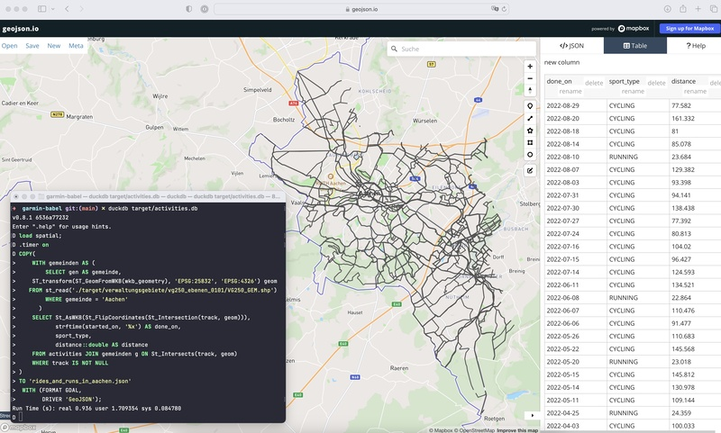

# garmin-babel

A Java program to massage Garmin data exported via [Garmin GDPR management](https://www.garmin.com/de-DE/account/datamanagement)
into usable CSV files for further processing.

⚠️ This program is not in any way, shape or form associated, supported or sponsored by Garmin. 
It's a personal project suiting my needs. It may or may not be helpful to other people.

## Installation

For copy&pasting the examples further down, you need to either build this tool yourself or pick one of the pre-build artifacts fitting your operating system and architecture.

### Pre-build artifacts

I have a limited, untested set of packages for various operating systems on the [release page](https://github.com/michael-simons/garmin-babel/releases).
They come either as plain Java distribution requiring a locally installed JDK, with batteries included (that is, with a JDK for a specific operating system and architecture) or as a native distribution not requiring a JDK at all. You can use them as follows (the example is based on the plain Java distribution):

```bash
mkdir -p target
cd target
curl -LO https://github.com/michael-simons/garmin-babel/releases/download/early-access/garmin-babel-1.0.0-SNAPSHOT.zip
unzip garmin-babel-1.0.0-SNAPSHOT.zip && mv garmin-babel-1.0.0-SNAPSHOT garmin-babel
cd - 
./target/garmin-babel/bin/garmin-babel --version
```

ℹ️ All archives with _native_ in their name can be run standalone, without a Java virtual machine. The ones with an operating system in their name are custom JVM bundles and OS specific. In case your operating system is not in the list, grab the one named `garmin-babel-x.y.z.zip`. That one requires [OpenJDK](https://adoptium.net/de/) or any other Java 17 installed.

### Building the tool yourself

You need Java 17 or higher installed to build the program. Build should be quite fast, there are no tests ;)

```bash
./mvnw clean package -no-transfer-progress
unzip -q target/artifacts/garmin-babel-*.zip -d target/garmin-babel
./target/garmin-babel/bin/garmin-babel --version
```

If you want to build a native binary for an architecture and operating system for which no binaries are available, you need to install [GraalVM](https://www.graalvm.org), including native-image and run the following:

```bash
./mvnw clean package -Dnative -pl app
mkdir -p target/garmin-babel/bin && mv ./app/target/garmin-babel target/garmin-babel/bin
./target/garmin-babel/bin/garmin-babel --version
```
## Usage

### Activities

The `dump-activities` command requires a username (your Garmin username), as recorded in the archive:

#### Dump all

The following will export all activities into a csv file.

```bash
./target/garmin-babel/bin/garmin-babel \
   ~/tmp/Garmin_Archive \
   dump-activities \
   --user-name=michael.simons \
   target/demo/activities.csv
```

#### Filtering

##### Filter by date and type

The date filters are generally available, the types are only for the activities

```bash
./target/garmin-babel/bin/garmin-babel \
  --start-date=2022-01-01 --end-date=2022-02-01 ~/tmp/Garmin_Archive \
  dump-activities \
  --user-name=michael.simons \
  --sport-type=CYCLING,SWIMMING
```

##### Combining filters

Get all runs longer than 15km prior to second half of 2022, displace speed as pace, use MySQL format

```bash
./target/garmin-babel/bin/garmin-babel \
  --csv-format=MySQL --speed-to-pace --end-date=2022-07-01 ~/tmp/Garmin_Archive \
  dump-activities \
  --user-name=michael.simons \
  --sport-type=RUNNING \
  --min-distance=15 \
  target/demo/long-runs.csv
```

Get all cycling activities longer than 75km prior to second half of 2022, prepared for loading into MySQL

```bash
./target/garmin-babel/bin/garmin-babel \
  --csv-format=MySQL --end-date=2022-07-01 ~/tmp/Garmin_Archive \
  dump-activities \
  --user-name=michael.simons \
  --sport-type=CYCLING \
  --activity-type=road_biking,gravel_cycling,cycling,mountain_biking,virtual_ride,indoor_cycling \
  --min-distance 75 \
  target/demo/long-rides.csv
```

#### Change units

```bash
./target/garmin-babel/bin/garmin-babel \
  --start-date=2022-01-01 --end-date=2022-01-10 --unit-distance=metre --speed-to-pace \
  ~/tmp/Garmin_Archive \
  dump-activities \
  --user-name=michael.simons \
  --sport-type=RUNNING
```

#### Downloading activities

⚠️ There is no guarantee whatsoever that this feature keeps working. It's basically doing the same what a user would manually click the download link on Garmin Connect. I added a bit of jitter when downloading things to not hammer the service like bot would do, but use this feature of the tool on your own risk!

While all activities are actually contained in the GDPR archive dump I didn't find any indicator which file belongs to which activity. This is sad, as I wanted to have them for my personal archive, at least some of them (Yes, I can go through the devices or the Garmin Connect page, but you know ;)).

Do download things you have to log in to [Garmin Connect](https://connect.garmin.com). Once done, open your Browsers developer tools and find the cookie jar. Find a cookie named `JWT_FGP` and copy its value.

Export it in your shell like this:

```bash
export GARMIN_JWT=jwt_token_from_your_cookie_store_for_garmin
```

Then in the _network_ tab of your Browsers developer tools (name might be different), clear all requests (or leave them, if you really want to search to the ton of requests the UI does). Then go to [activities](https://connect.garmin.com/modern/activities) for example and look in the requests tab for a request to `activities`. Look for something that says `HEADER` and in those headers look for `Authorization: Bearer ` and copy that (very long) very long header and export it, too.

```bash
export GARMIN_BACKEND_TOKEN=long_gibberish_token_from_one_of_the_requests
```

Then, the `--download` option can be used like this:

```bash
./target/garmin-babel/bin/garmin-babel \
  --csv-format=MySQL --speed-to-pace --end-date=2022-07-01 ~/tmp/Garmin_Archive \
  dump-activities \
  --user-name=michael.simons \
  --sport-type=RUNNING \
  --min-distance=15 \
  --download=fit \
  target/demo/long-runs.csv
```

#### Fun with SQL

For aggregating I recommend importing the CSV data into a proper database.
[DuckDB](https://duckdb.org) is a pretty good choice for online analytics, even in memory.
Here are two examples that I found useful:

##### Getting the 10 fastest long runs

```bash
./target/garmin-babel/bin/garmin-babel ~/tmp/Garmin_Archive dump-activities --user-name=michael.simons |
duckdb -s "
  WITH
   runs AS (
     SELECT name, 3600.0/avg_speed AS pace, distance
     FROM read_csv_auto('/dev/stdin')
     WHERE sport_type = 'RUNNING'
       AND distance > 20
   ),
   paced_runs AS (
     SELECT name, distance, cast(floor(pace/60) AS int) || ':' || cast(floor(pace%60) AS int) AS pace FROM runs
   )
  SELECT dense_rank() OVER (ORDER BY pace ASC) AS rnk, name, distance, pace
  FROM paced_runs
  QUALIFY rnk <= 10
"
```

##### What gear did I use the most

Note: If you have more than one item used per activity, the following want work:

```bash
./target/garmin-babel/bin/garmin-babel ~/tmp/Garmin_Archive dump-activities --user-name=michael.simons |
duckdb -s " 
  WITH
    cycle_activities AS (
      SELECT *
      FROM read_csv_auto('/dev/stdin')
      WHERE (sport_type = 'CYCLING' OR activity_type in ('road_biking', 'gravel_cycling', 'cycling', 'mountain_biking', 'virtual_ride', 'indoor_cycling'))
        AND gear IS NOT NULL AND gear <> ''
    ),
    totals AS (
      SELECT sum(moving_duration) AS duration, sum(distance) AS distance, gear
      FROM cycle_activities
      GROUP by gear
    )
  SELECT gear,
         cast(floor(distance) AS integer) AS distance,
         cast(floor(duration/3600) AS integer) || ':' || cast(floor(duration%3600/60) AS integer) || ':' || cast(floor(duration%3600%60) as integer) AS duration
  FROM totals
  ORDER BY totals.duration DESC
"
```

##### Distribution of mileages

```bash
./target/garmin-babel/bin/garmin-babel ~/tmp/Garmin_Archive dump-activities --user-name=michael.simons |
duckdb -s "
  WITH 
    cycle_activities AS (
      SELECT distance
      FROM read_csv_auto('/dev/stdin')
      WHERE (sport_type = 'CYCLING' OR activity_type in ('road_biking', 'gravel_cycling', 'cycling', 'mountain_biking', 'virtual_ride', 'indoor_cycling'))
        AND gear IS NOT NULL AND gear <> ''
    ),
    distances AS (
      SELECT CASE
        WHEN distance >= 300 THEN '1. More than 300km'
        WHEN distance >= 200 THEN '2. More than 200km'
        WHEN distance >= 100 THEN '3. More than 100km'
        WHEN distance >=  75 THEN '4. More than 75'
        ELSE '5. Between 0 and 75' END AS value
      FROM cycle_activities
    )
  SELECT substr(value, 4) || ': ' || count(*) || ' times' AS times FROM distances
  GROUP BY value
  ORDER BY value ASC
"
```

##### Working with spatial data

Spatial you say? DuckDb has you covered: [PostGEESE? Introducing The DuckDB Spatial Extension](https://duckdb.org/2023/04/28/spatial.html).

Let's create a proper database first, with an actual table holding the activities:

```bash
./target/garmin-babel/bin/garmin-babel ~/tmp/Garmin_Archive dump-activities --user-name=michael.simons |
duckdb -s "
  INSTALL spatial;
  LOAD spatial;
  CREATE TABLE IF NOT EXISTS activities (
     garmin_id BIGINT, name VARCHAR(256), started_on TIMESTAMP, activity_type VARCHAR(32), sport_type VARCHAR(32), distance NUMERIC, elevation_gain NUMERIC, avg_speed NUMERIC, max_speed NUMERIC, duration NUMERIC, elapsed_duration NUMERIC, moving_duration NUMERIC, v_o_2_max NUMERIC, start_longitude DECIMAL(12,8), start_latitude DECIMAL(12,8), end_longitude DECIMAL(12,8), end_latitude DECIMAL(12,8), gear VARCHAR(256),
     PRIMARY KEY(garmin_id)
  );
  INSERT INTO activities SELECT * FROM read_csv_auto('/dev/stdin');
  ALTER table activities ADD COLUMN track GEOMETRY;
" target/activities.db
```

Now download some data (follow the instructions for downloading above):

```bash
./target/garmin-babel/bin/garmin-babel ~/tmp/Garmin_Archive dump-activities --user-name=michael.simons \
  --sport-type=CYCLING \
  --activity-type=road_biking,gravel_cycling,cycling,mountain_biking,virtual_ride,indoor_cycling \
  --min-distance 75 \
  --download=gpx \
  target/activities/long-rides.csv
./target/garmin-babel/bin/garmin-babel ~/tmp/Garmin_Archive dump-activities --user-name=michael.simons \
  --sport-type=RUNNING \
  --min-distance=15 \
  --download=gpx \
  target/activities/long-runs.csv
```

As the downloads are not one big shape file containing all tracks as features, we must query all GPX files manually.
Let's create a SQL script todo this, ofc with DuckDB CLI:

```bash
duckdb --noheader -list -s "
SELECT 'UPDATE activities ' ||
       'SET track = (' ||
       'SELECT ST_FlipCoordinates(ST_GeomFromWKB(wkb_geometry)) FROM st_read(''target/activities/' || garmin_id  || '.gpx'', layer=''tracks'')' ||
       ') WHERE garmin_id = '|| garmin_id || ';'
FROM activities
WHERE (sport_type = 'RUNNING' AND distance >= 15)
  OR (sport_type = 'CYCLING' AND distance >= 75 AND activity_type IN ('road_biking','gravel_cycling','cycling','mountain_biking','virtual_ride','indoor_cycling'));
" target/activities.db > target/load_tracks.sql
duckdb -s "INSTALL spatial; LOAD spatial;" -s ".read target/load_tracks.sql" target/activities.db
```

*NOTE* For whatever reason the coordinates will be in long/lat when I read from the GPX file without applying `ST_FlipCoordinates`. 

Now let's answer the question, through which German communities did I ran and ride the most?
Germany offers a lot of spatial data for free, for example the [Verwaltungsgebiete](https://gdz.bkg.bund.de/index.php/default/digitale-geodaten/verwaltungsgebiete.html).
Let's grab them:

```bash
rm -rf target/verwaltungsgebiete && mkdir -p target/verwaltungsgebiete && \
curl https://daten.gdz.bkg.bund.de/produkte/vg/vg250_ebenen_0101/aktuell/vg250_01-01.utm32s.shape.ebenen.zip | \
bsdtar xvf - --strip-components=1 -C target/verwaltungsgebiete
```
I picked the 1:250000 in the UTM32s (EPSG:25832) reference system (see [Georeferenzierungen](https://gdz.bkg.bund.de/index.php/default/georeferenzierungen/)) which is close enough to WGS84.
The following query demonstrates the spatial extension of DuckDB by transforming UTM32s into WGS-84 and then computing a join based on the intersection of two geometries:

```bash
duckdb -s ".mode markdown" -s "
  LOAD spatial;
  WITH gemeinden AS (
    SELECT gen AS gemeinde,         
           ST_transform(ST_GeomFromWKB(wkb_geometry), 'EPSG:25832', 'EPSG:4326') geom
    FROM st_read('./target/verwaltungsgebiete/vg250_ebenen_0101/VG250_GEM.shp')
  ),
  intersections AS (
    SELECT gemeinde, 
           round(sum(St_length(ST_transform(St_Intersection(track, geom), 'EPSG:4326', 'EPSG:25832'))) / 1000) as km
    FROM activities JOIN gemeinden g ON St_Intersects(track, geom)
    WHERE track IS NOT NULL
    GROUP BY gemeinde
  )
  SELECT dense_rank() OVER (ORDER BY km DESC) as rnk, 
         gemeinde, 
         km
  FROM intersections
  QUALIFY rnk <= 10
  ORDER BY rnk, gemeinde;
" target/activities.db
```

This is probably dated soon, but I like the result very much: My top 10 communities by kilometers ran or cycled in them:

| rnk |     gemeinde     |   km   |
|-----|------------------|--------|
| 1   | Aachen           | 2800.0 |
| 2   | Stolberg (Rhld.) | 1093.0 |
| 3   | Simmerath        | 803.0  |
| 4   | Jülich           | 349.0  |
| 5   | Hürtgenwald      | 314.0  |
| 6   | Eschweiler       | 278.0  |
| 7   | Würselen         | 237.0  |
| 8   | Düren            | 224.0  |
| 9   | Monschau         | 211.0  |
| 10  | Aldenhoven       | 193.0  |

You might ask why transforming back to _ETRS89 / UTM zone 32N_ by `ST_transform(St_Intersection(track, geom), 'EPSG:4326', 'EPSG:25832')` before calling `St_length`? Because the latter computes the length in units of the reference system and WGS-84 doesn't use meters.

You can also export spatial data, creating new feature files.
Here I use the GeoJSON driver:

```sql
COPY(
    WITH gemeinden AS (
        SELECT gen AS gemeinde,
               ST_transform(ST_GeomFromWKB(wkb_geometry), 'EPSG:25832', 'EPSG:4326') geom
        FROM st_read('./target/verwaltungsgebiete/vg250_ebenen_0101/VG250_GEM.shp')
        WHERE gemeinde = 'Aachen'
      )
    SELECT St_AsWKB(St_FlipCoordinates(St_Intersection(track, geom))),
           strftime(started_on, '%x') AS done_on,
           sport_type,
           distance::double AS distance
    FROM activities JOIN gemeinden g ON St_Intersects(track, geom)
    WHERE track IS NOT NULL
)
TO 'docs/example/rides_and_runs_in_aachen.geojson'
 WITH (FORMAT GDAL, DRIVER 'GeoJSON');
```

The result can be viewed on [GeoJSON.io](http://geojson.io/#id=github:michael-simons/garmin-babel/blob/main/docs/example/rides_and_runs_in_aachen.geojson&map=10.88/50.7477/6.0948):



### Gear

Exporting all your gear:

```bash
./target/garmin-babel/bin/garmin-babel ~/tmp/Garmin_Archive \
  dump-gear \
  --user-name=michael.simons
```

### Fitness data 

#### All fitness data

You can use the bash script [`bin/export_fitness_metrics.sh`](./bin/export_fitness_metrics.sh) to export a broad range of your fitness data stored in the Garmin Archive, including daily resting heart rate, weights, fitness age, VO2Max etc.
Use it like this:

```
./bin/export_fitness_metrics.sh ~/tmp/Garmin_Archive > fitness_data.csv
```

The script exports the following fields:

|    column_name     | column_type  | null |
|--------------------|--------------|------|
| ref_date           | DATE         | NO   |
| chronological_age  | BIGINT       | YES  |
| biological_age     | DECIMAL(5,2) | YES  |
| weight             | DECIMAL(5,2) | YES  |
| body_fat           | DECIMAL(5,2) | YES  |
| resting_heart_rate | BIGINT       | YES  |
| vo2max_biometric   | DECIMAL(5,2) | YES  |
| vo2max_running     | DECIMAL(5,2) | YES  |
| vo2max_cycling     | DECIMAL(5,2) | YES  |
| avg_stress_level   | BIGINT       | YES  |
| min_heart_rate     | BIGINT       | YES  |
| max_heart_rate     | BIGINT       | YES  |
| body_water         | DECIMAL(5,2) | YES  |
| bone_mass          | DECIMAL(5,2) | YES  |
| muscle_mass        | DECIMAL(5,2) | YES  |
| lowest_spo2_value  | BIGINT       | YES  |

#### Weights

The original `garmin-babel` has a dedicated option for exporting the weights alone.
Use this if you don't want DuckDB.

##### Exporting

The following will export weights prior to a given date, in kg, to a file name `weights.csv`, formatted for MySQL:

```bash
./target/garmin-babel/bin/garmin-babel \
  --csv-format=mysql --unit-weight=kilogram --end-date=2022-07-01 ~/tmp/Garmin_Archive \
  dump-weights \
  target/demo/weights.csv
```

##### Loading

As it is possible to store multiple weight measurements per day, you need to filter that file afterward.
Here, I do this by a unique constraint in MySQL while loading:

```sql
CREATE TABLE IF NOT EXISTS weights_in(measured_on date, value DECIMAL(6,3), unique(measured_on));
LOAD DATA LOCAL INFILE 'target/demo/weights.csv'
INTO TABLE weights_in
IGNORE 1 LINES
(@measured_on, value)
SET measured_on = date(str_to_date(@measured_on, '%Y-%m-%dT%H:%i:%sZ'))
;
```

## Other tooling for (Garmin) FIT files

* The official Garmin FIT SDK: https://developer.garmin.com/fit/overview/, the exports of `FIT CSV Tool` are a great fit for DuckDB analytics; the tool works well as GraalVM native image, too (`native-image -jar FitCSVTool.jar` gives you a nice standalone executable)
* Rusty, but fit: https://github.com/meistermeier/rusty-but-fit Gerrits tool (and library) for parsing FIT data
